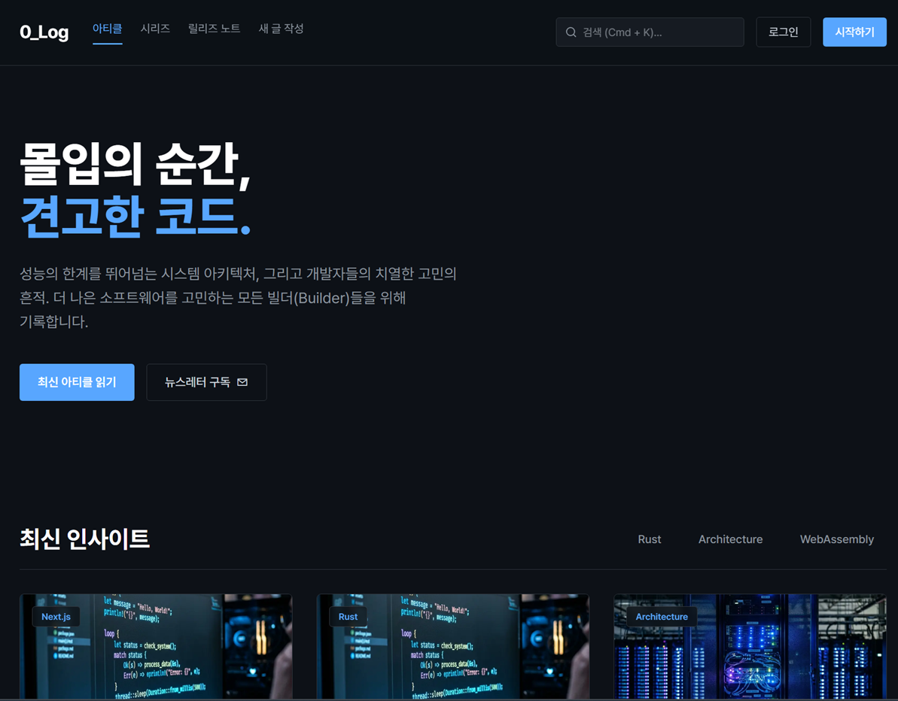
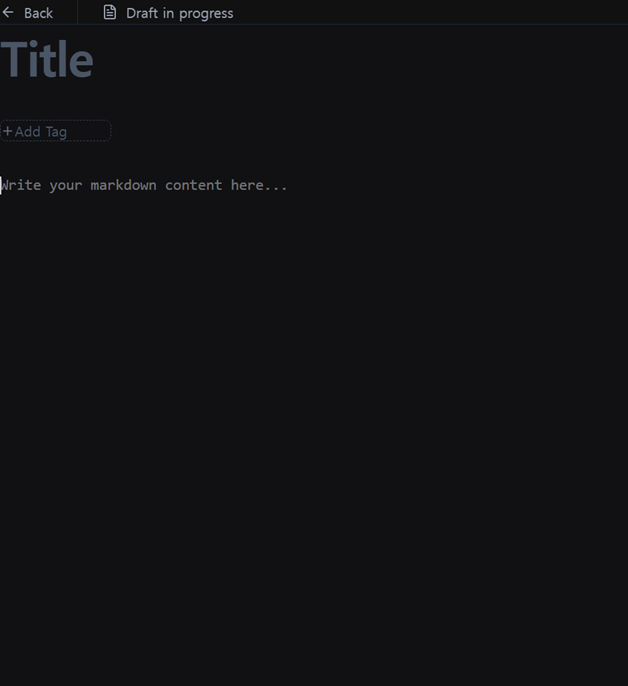
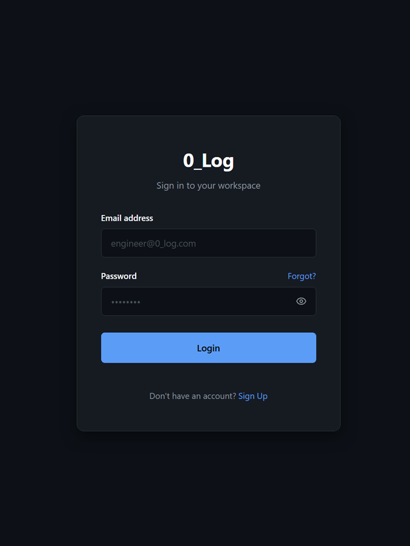

# 0_Log (Zero Log) - Modern Blog Platform

> 프론트엔드 최신 기술 스택(Next.js 16 App Router)과 서버리스 BaaS(Supabase)를 활용하여 개발된 마크다운 기반의 개발자 전용 블로그 플랫폼입니다.
> 프리미엄 UI/UX 원칙을 적용하여 시각적 완성도를 높이고, 실시간 마크다운 렌더링 및 인증 기반의 개인화된 작성 경험을 제공합니다.

<br/>

## 🛠 Tech Stack


<br/>

---

## 📸 Screenshots

### 1. 메인 화면 (Main Home)


### 2. 마크다운 에디터 (Write Post)


### 3. 인증 화면 (Login / Signup)


<br/>

---

본 프로젝트는 개발자가 자신의 지식과 경험을 체계적으로 기록하고 공유할 수 있도록 돕는 웹 서비스입니다.
SSR(Server-Side Rendering)을 통한 SEO 최적화와 사용자 경험 향상을 목표로 기획되었으며, 데이터베이스 설계부터 UI/UX 구현까지 전체 풀스택 파이프라인을 다룹니다.

<br/>

| 문제점 | 해결 방안 (프로젝트 목표) |
|---|---|
| 복잡한 블로그 설정 및 유지보수 | 서버리스 BaaS(Supabase)를 도입하여 백엔드 및 인프라 관리 리소스 최소화 |
| 제한적인 포맷팅 기능 | `react-markdown`을 연동하여 개발자 친화적인 마크다운 실시간 프리뷰 에디터 제공 |
| 정적이고 일률적인 디자인 | 다크 모드, 글래스모피즘, 마이크로 인터랙션을 적용하여 모던하고 몰입감 있는 UI/UX 구현 |

<br/>

---

### 주요 기능 (Key Features)

| 기능 | 세부 내용 |
|---|---|
| **회원 인증 체계** | Supabase Auth를 활용한 안전한 이메일/비밀번호 기반 로그인 및 회원가입 |
| **마크다운 에디터** | 실시간 렌더링을 지원하는 작성 환경 (카테고리 및 태그 설정 연동) |
| **블로그 상세 뷰** | 작성자 메타데이터(프로필, 예상 읽기 시간) 및 대댓글(Discussion) UI 구성 |
| **프리미엄 UI/UX** | CSS Modules를 활용한 정교한 애니메이션 및 디자인 토큰 제어 |
| **반응형 웹 디자인** | 데스크탑, 태블릿, 모바일을 모두 지원하는 유연한 레이아웃 구성 |

<br/>

---

### 📂 프로젝트 구조 (Project Structure)

```text
blog_platform/
├── app/
│   ├── login/           # 로그인 및 회원가입 페이지 (인증 로직)
│   ├── posts/
│   │   └── [id]/        # 포스트 상세 페이지 (동적 라우팅, SSR)
│   ├── write/           # 마크다운 에디터 페이지 (Client Component)
│   ├── layout.tsx       # 글로벌 Root Layout 및 메타데이터 정의
│   └── page.tsx         # 메인 홈페이지 (포스트 리스트 및 카테고리 필터)
├── components/          # 공통 UI 컴포넌트 (Navbar, Footer 등)
├── supabase/
│   ├── migrations/      # DB 스키마 생성 및 마이그레이션 SQL
│   └── seed.sql         # 초기 테스트용 Mock 데이터 시드
├── utils/               # 유틸리티 함수 (Supabase Client/Server 인스턴스)
└── package.json         # 의존성 및 스크립트 관리
```

<br/>

---

### 🚀 Getting Started

#### 1. Repository Clone
```bash
git clone https://github.com/0Jae/0_log-platform.git
cd 0_log-platform
```

#### 2. Install Dependencies
```bash
npm install
```

#### 3. Environment Variables
프로젝트 최상단 루트에 `.env.local` 파일을 생성하고 Supabase 프로젝트 정보를 입력합니다.
```env
NEXT_PUBLIC_SUPABASE_URL=your_supabase_project_url
NEXT_PUBLIC_SUPABASE_ANON_KEY=your_supabase_anon_key
```

#### 4. Run Development Server
```bash
npm run dev
```

<br/>

---

### 🛠 My Role
본 프로젝트에서 담당한 주요 역할은 다음과 같습니다.

| 역할 | 내용 |
|---|---|
| **기획 및 아키텍처** | Next.js App Router 및 Supabase 기반의 전체 시스템 아키텍처 설계 |
| **데이터베이스 설계** | Supabase PostgreSQL을 활용한 사용자 및 포스트 테이블 스키마 설계 및 마이그레이션 구성 |
| **인증 로직 구현** | `@supabase/ssr`을 활용한 서버/클라이언트 사이드 인증 플로우 통합 |
| **프론트엔드 개발** | 다크 모드 특화 디자인 시스템 구축 및 재사용 가능한 UI 컴포넌트 개발 |
| **에디터 구현** | `react-markdown`을 연동한 실시간 프리뷰 블로그 작성 페이지 구현 |

<br/>

---

### Limitations & Future Work

#### Limitations
- 현재는 텍스트 기반 마크다운 렌더링에 최적화되어 있으며, 복잡한 미디어 파일(비디오 등) 업로드에는 외부 스토리지 최적화가 추가로 필요합니다.
- 초기 MVP 버전으로, 소셜 로그인(OAuth) 기능은 아직 통합되지 않았습니다.

#### Future Work
- **Oauth 연동**: GitHub, Google 등 개발자 친화적인 소셜 로그인 기능 추가
- **이미지 업로드**: Supabase Storage를 연동한 본문 내 이미지 드래그 앤 드롭 업로드 지원
- **검색 최적화(SEO) 및 전문 검색**: 본문 내용 기반의 Full-Text Search 기능 도입
- **통계 대시보드**: 작성자별 포스트 조회수 및 반응(좋아요 등) 통계 제공

<br/>

---

### Notice
본 프로젝트는 포트폴리오를 목적으로 제작되었습니다. 코드 아키텍처 및 디자인 시스템에 대한 리뷰와 피드백은 언제나 환영합니다.
